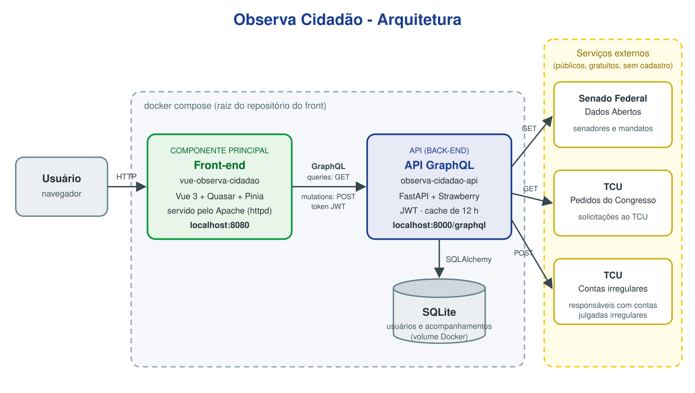

# Observa Cidadão

Interface web para acompanhar os senadores em exercício com dados públicos do **Senado Federal** e do **Tribunal de Contas da União (TCU)**.

O cidadão consulta os 81 senadores, filtra por UF, partido, sexo, bloco parlamentar, cargo e fim do mandato, abre o perfil de cada um (mandatos, solicitações ao TCU e contas julgadas irregulares) e, com uma conta, monta sua lista de senadores acompanhados com anotações pessoais.

Este repositório é o **componente principal** do MVP. Ele conversa com a API [observa-cidadao-api](https://github.com/Fernando11K/observa-cidadao-api), que consome os serviços externos e guarda os dados dos usuários.

## Funcionalidades

- Lista de senadores em cards, com foto, partido, UF, sexo, suplência, Mesa Diretora, liderança, bloco e fim do mandato.
- Busca por nome e filtros por UF, partido (múltiplos), sexo, fim do mandato, titular ou suplente, bloco parlamentar e cargo.
- Perfil do senador com mandatos, solicitações ao TCU e contas julgadas irregulares.
- Cadastro e login com token JWT.
- Acompanhamentos: acompanhar um senador com anotação, editar a anotação, remover e filtrar "só os que acompanho".
- Layout responsivo: menu na barra superior no desktop e barra inferior com menu lateral no celular.

## Arquitetura



| Componente            | Repositório                                                               | Tecnologias                                     | Porta                      |
| --------------------- | ------------------------------------------------------------------------- | ----------------------------------------------- | -------------------------- |
| Front-end (principal) | [vue-observa-cidadao](https://github.com/Fernando11K/vue-observa-cidadao) | Vue 3, Quasar, Pinia, Axios, TypeScript         | 8080 (Docker) / 9000 (dev) |
| API                   | [observa-cidadao-api](https://github.com/Fernando11K/observa-cidadao-api) | Python, FastAPI, Strawberry GraphQL, SQLAlchemy | 8000                       |
| Banco de dados        | dentro da API                                                             | SQLite                                          | -                          |
| Serviços externos     | -                                                                         | APIs públicas do Senado Federal e do TCU        | -                          |

O front se comunica com a API por **GraphQL** em `http://localhost:8000/graphql`. As consultas (queries) são enviadas por HTTP **GET** e as alterações (mutations) por HTTP **POST**. As rotas autenticadas levam o cabeçalho `Authorization: Bearer <token>`.

O front nunca chama os serviços externos diretamente: a API busca, trata e combina os dados do Senado e do TCU, e o usuário continua sempre dentro da aplicação.

### Operações usadas pelo front

GraphQL usa um único endereço. A tabela mostra a operação que corresponde a cada método REST:

| Método REST equivalente | Operação GraphQL                                 | Método HTTP enviado | Onde é usada                                           |
| ----------------------- | ------------------------------------------------ | ------------------- | ------------------------------------------------------ |
| GET                     | `senadores`, `senador`, `acompanhamentos`, `eu`  | GET                 | lista, perfil do senador, meus acompanhamentos, sessão |
| POST                    | `cadastrarUsuario`, `login`, `acompanharSenador` | POST                | cadastro, login, botão "Acompanhar"                    |
| PUT                     | `atualizarAcompanhamento`                        | POST                | "Editar anotação"                                      |
| DELETE                  | `removerAcompanhamento`                          | POST                | "Remover"                                              |

## APIs externas

As três são públicas, gratuitas e não exigem cadastro nem chave de acesso. São consumidas pela API, que trata os dados antes de entregá-los ao front.

### Senado Federal - Dados Abertos Legislativos

- **Documentação:** <https://legis.senado.leg.br/dadosabertos/api-docs/swagger-ui/index.html>
- **Licença:** dados abertos de livre utilização, exigindo no máximo a citação da fonte ([Sobre Dados Abertos do Senado](https://www12.senado.leg.br/dados-abertos/sobre)).
- **Cadastro:** não é necessário.
- **Rotas usadas:**

| Método | Rota                                                                     | Uso                    |
| ------ | ------------------------------------------------------------------------ | ---------------------- |
| GET    | `https://legis.senado.leg.br/dadosabertos/senador/lista/atual?v=4`       | senadores em exercício |
| GET    | `https://legis.senado.leg.br/dadosabertos/senador/{codigo}?v=6`          | detalhe do senador     |
| GET    | `https://legis.senado.leg.br/dadosabertos/senador/{codigo}/mandatos?v=5` | mandatos do senador    |

### TCU - Webservices públicos

- **Documentação:** <https://sites.tcu.gov.br/dados-abertos/webservices-tcu/>
- **Licença:** conteúdo público que pode ser republicado citando a fonte, sem uso comercial ([Termos de Uso do Portal TCU](https://portal.tcu.gov.br/sobre-o-portal/termos-de-uso)).
- **Cadastro:** não é necessário.
- **Rotas usadas:**

| Método | Rota                                                                            | Uso                                                                       |
| ------ | ------------------------------------------------------------------------------- | ------------------------------------------------------------------------- |
| GET    | `https://contas.tcu.gov.br/ords/api/publica/scn/pedidos_congresso`              | solicitações do Congresso ao TCU, filtradas pelo nome do senador          |
| POST   | `https://certidoes.apps.tcu.gov.br/api/publico/responsaveis-contas-irregulares` | responsáveis com contas julgadas irregulares, buscados pelo nome completo |

Para não sobrecarregar esses serviços, a API guarda as respostas em cache por 12 horas.

## Como executar

### Opção 1: tudo com Docker Compose (recomendado)

Sobe o front e a API juntos. A API é construída direto do repositório no GitHub, então basta clonar este repositório.

Pré-requisito: [Docker](https://docs.docker.com/get-docker/) com o plugin Compose.

```bash
git clone https://github.com/Fernando11K/vue-observa-cidadao.git
cd vue-observa-cidadao
docker compose up -d --build
```

| Serviço        | Endereço                        |
| -------------- | ------------------------------- |
| Front-end      | <http://localhost:8080>         |
| API (GraphiQL) | <http://localhost:8000/graphql> |

As portas 8080 e 8000 precisam estar livres. Os dados do SQLite ficam no volume `dados-api` e sobrevivem à recriação dos containers.

Para parar:

```bash
docker compose down        # mantém os dados
docker compose down -v     # apaga também o banco
```

Para buscar a versão mais recente da API no GitHub:

```bash
docker compose build --no-cache api && docker compose up -d
```

### Opção 2: só o front em Docker

Com a API já rodando em `http://localhost:8000`:

```bash
docker build -t vue-observa-cidadao .
docker run -d --name observa-front -p 8080:80 vue-observa-cidadao
```

Acesse <http://localhost:8080>. A imagem faz o build com Node e serve os arquivos estáticos com o Apache (`httpd`).

### Opção 3: ambiente de desenvolvimento

Pré-requisitos: Node.js 22.12+, 24 ou 26+ e a API rodando em `http://localhost:8000` (veja o README da API).

```bash
npm install
npx quasar dev
```

O Quasar abre a aplicação em <http://localhost:9000> com recarregamento automático.

Outros comandos:

| Comando             | O que faz                                 |
| ------------------- | ----------------------------------------- |
| `npm run lint`      | formata com Prettier e corrige com ESLint |
| `npm run typecheck` | checa os tipos com `vue-tsc`              |
| `npx quasar build`  | gera a versão de produção em `dist/spa`   |

## Estrutura de pastas

```
src/
├── api/              # chamadas GraphQL (senadores, usuários, acompanhamentos)
├── assets/           # logo e itens do menu
├── boot/             # Axios, autenticação e notificações
├── components/
│   ├── common/       # busca por nome, estados vazios e selects de filtro
│   ├── senador/      # card, foto e botão de acompanhar
│   └── usuario/      # caixa de login/cadastro, campos de e-mail e senha
├── layouts/          # layout principal, cabeçalho, menu lateral e rodapés
├── models/           # tipos TypeScript
├── pages/            # telas (senadores, senador, acompanhamentos, login, cadastro)
├── router/           # rotas (modo hash)
├── stores/           # Pinia: usuário (JWT) e acompanhamentos
└── utils/            # datas, erros, diálogos, rotas e texto
```

## Autor

Fernando Mendonça - [LinkedIn](https://br.linkedin.com/in/fernando11000)

MVP desenvolvido para a Sprint Arquitetura de Software da Pós-Graduação em Engenharia de Software da Puc-Rio.
